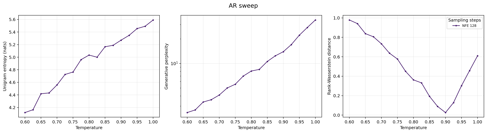
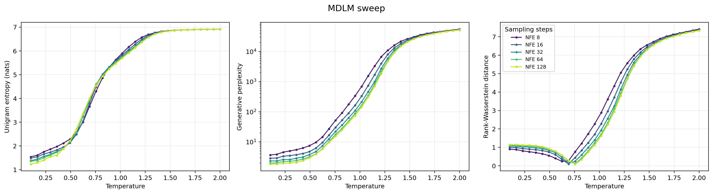
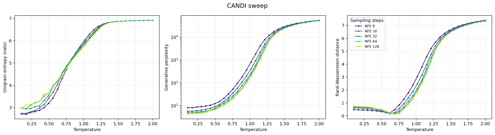
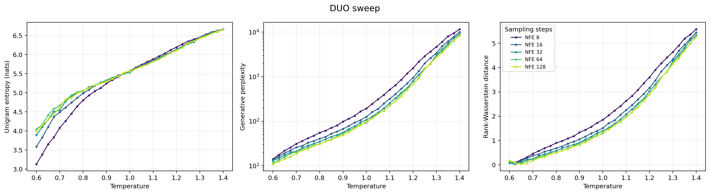
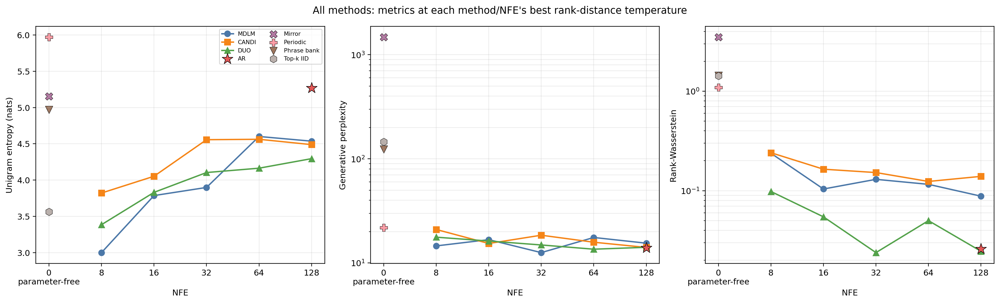
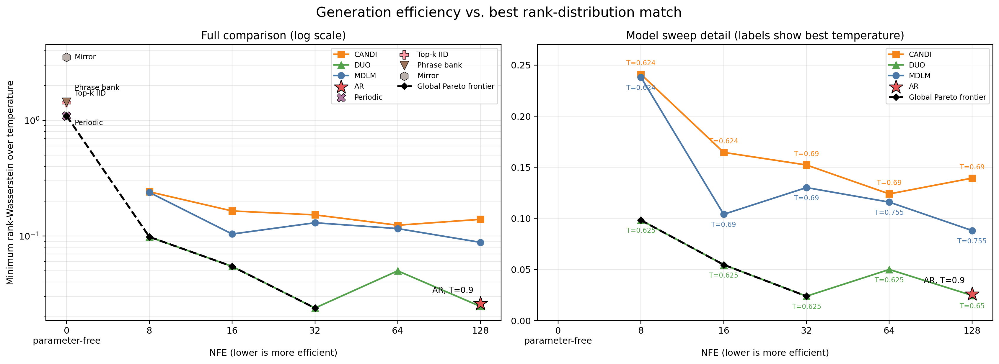
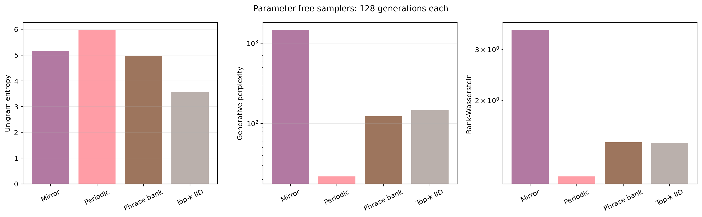
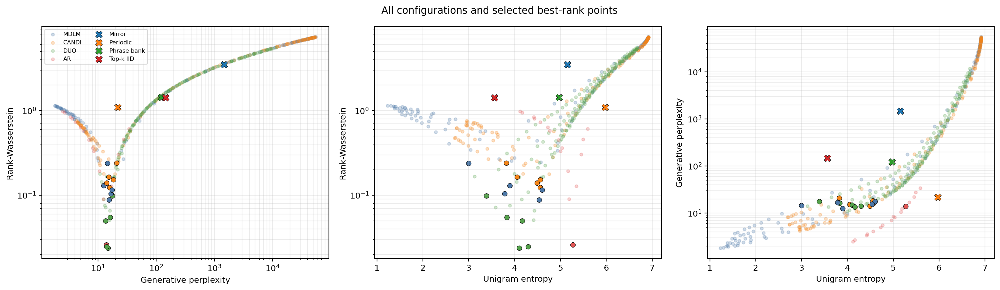

# Ranking Divergence

Lightweight evaluation utilities for LLM rank-histogram divergences, plus an
OpenWebText analysis pipeline for comparing GPT-2 samples against simple
zero-parameter text baselines.

The core idea is described in [docs/ranking_summary_notes.md](docs/ranking_summary_notes.md):
use a fixed autoregressive reference LM as a ruler. For each real or generated
next-token transition, record the rank the reference model assigns to the
observed next token, build rank histograms for real and generated text, then
compare the histograms with a closed-form Wasserstein-1 distance on the log-rank
axis.

```python
from transformers import AutoModelForCausalLM, AutoTokenizer
from ranking_divergence import rank_wasserstein

tokenizer = AutoTokenizer.from_pretrained("gpt2-large")
tokenizer.pad_token = tokenizer.eos_token
model = AutoModelForCausalLM.from_pretrained("gpt2-large")

result = rank_wasserstein(
    reference_texts=["Human-written reference text."],
    comparison_texts=["Generated text to evaluate."],
    model=model,
    tokenizer=tokenizer,
)
print(result.distance)
```

## Results

The full numerical discussion is in
[docs/important_results.md](docs/important_results.md). The main result is that
rank-Wasserstein favors an intermediate generation regime: it penalizes both
low-temperature repetitive collapse and high-temperature unlikely token
choices.

### Autoregressive temperature sweep

The AR sweep has a clear V-shaped rank-distance curve. At temperature 0.60,
rank-Wasserstein is 0.978 and Rep-3 is 0.593; the best match occurs at
temperature 0.90 with rank-Wasserstein 0.0261; by temperature 1.00 the distance
rises to 0.610.



### Diffusion model sweeps

MDLM, CANDI, and DUO show the same broad behavior: low-temperature
concentration and high-temperature distributional drift both worsen the rank
match. DUO gives the strongest results, reaching rank-Wasserstein 0.0239 at NFE
32 and temperature 0.625.







### Cross-method comparison

The following summary selects the temperature with the lowest rank-Wasserstein
for each method and NFE. AR is shown at the requested comparison cost of NFE
128.



The efficiency frontier is formed by DUO at NFE 8, 16, and 32. DUO at NFE 32
slightly outperforms both DUO and AR at NFE 128.



### Parameter-free baselines

The parameter-free samplers were evaluated with 128 generations each. Periodic
is the strongest of these baselines at rank-Wasserstein 1.092, but remains much
farther from the held-out rank distribution than the learned models.



### Metric tradeoffs



## Install

```bash
uv pip install -e .
```

For the OpenWebText analysis scripts:

```bash
uv pip install -e ".[examples]"
```

## Use From Another Local Project

In theory, this repository should work as an editable dependency in another
local project because it uses a standard Python `src/` layout and is managed
with uv. This is one of the main reasons to use uv: local packages,
environments, dependency resolution, and lockfiles can be managed through one
consistent workflow.

The intended workflow from another uv-managed project is:

```bash
cd /path/to/another-project
uv init  # omit this if the project already has a pyproject.toml
uv add --editable /home/patrick/ranking-divergence
```

The package should then be importable normally:

```python
from ranking_divergence import (
    rank_wasserstein,
    score_token_ids,
    unique_ngram_ratios,
)
```

You can check which checkout is being imported with:

```bash
uv run python -c \
  "import ranking_divergence; print(ranking_divergence.__file__)"
```

For an editable installation, this should print a path under:

```text
/home/patrick/ranking-divergence/src/ranking_divergence/
```

The consumer project's `pyproject.toml` should contain an editable path source
similar to:

```toml
[project]
dependencies = [
    "ranking-divergence",
]

[tool.uv.sources]
ranking-divergence = {
    path = "/home/patrick/ranking-divergence",
    editable = true,
}
```

### Choosing a PyTorch backend

The package itself does not require a particular CUDA version. Replace the
PyTorch version, uv index name, and index URL below with the CUDA version
supported by your machine. This example uses CUDA 12.1 because that is what the
current experiment server supports:

```toml
[project]
dependencies = [
    "ranking-divergence",
    "torch==2.5.1",
]

[tool.uv.sources]
ranking-divergence = {
    path = "/home/patrick/ranking-divergence",
    editable = true,
}
torch = [{ index = "pytorch-cu121" }]

[[tool.uv.index]]
name = "pytorch-cu121"
url = "https://download.pytorch.org/whl/cu121"
explicit = true
```

After editing dependency configuration, synchronize and verify the selected
backend:

```bash
uv sync
uv run python -c \
  "import torch; print(torch.__version__, torch.version.cuda, torch.cuda.is_available())"
```

On the current experiment server, the expected environment is PyTorch
`2.5.1+cu121`, CUDA runtime `12.1`, and `True` for CUDA availability. For
another machine, replace `2.5.1`, `cu121`, and the PyTorch index URL with the
corresponding compatible versions. CPU-only and Apple Silicon projects should
use their appropriate PyTorch configuration instead.

## What Is Included

- Rank histogram computation under a fixed causal LM reference model.
- Closed-form log-rank Wasserstein distance between normalized rank histograms.
- Rank-Wasserstein convenience wrapper for reference/generated text sets.
- Generative perplexity helpers, including a DUO-style variant that masks padding
  and handles EOS positions similarly to DUO.
- Unigram entropy, average per-sample unigram entropy, Rep-n, and unique n-gram
  ratios.
- Four zero-parameter samplers from [docs/baselines_to_use.pdf](docs/baselines_to_use.pdf):
  Top-k IID, Mirror-k, Periodic-k, and Phrase bank-m.
- OpenWebText split/cache helpers matching the DUO convention.
- An OpenWebText analysis CLI that generates samples, computes metrics, and
  writes CSV/JSON/Markdown/LaTeX/plot artifacts.
- Smoke/full bash scripts for CUDA machines.
- Unit tests for rank distance, samplers, split helpers, n-gram metrics, and CLI
  defaults. The full GPT/OpenWebText run remains a manual integration run.

## OpenWebText Analysis

The main analysis script is [examples/openwebtext_analysis.py](examples/openwebtext_analysis.py).
It follows the DUO OpenWebText conventions:

- sampler/training source: `openwebtext`, split `train[:-100000]`
- held-out reference/evaluation source: `openwebtext`, split `train[-100000:]`
- cache path: `/home/patrick/.cache/discrete_diffusion/owt`
- tokenizer: `gpt2`
- scorer/reference LM: `gpt2-large`
- default sample length/eval cap: `1024`

GPT-2 generation uses:

```text
do_sample=True
temperature=1.0
top_p=1.0
top_k=0
```

GPT-2 is allowed to stop naturally at EOS. The script trims generated token IDs
at the first EOS, so entropy and n-gram metrics do not count padding/EOS tails.
Baseline samplers generate exactly `sample_length` token IDs.

Run a small smoke test on CUDA device `0`:

```bash
./scripts/openwebtext_smoke.sh 0
```

Run a fuller analysis on CUDA device `0`:

```bash
./scripts/openwebtext_full.sh 0
```

Extra CLI args are forwarded after the CUDA device argument:

```bash
./scripts/openwebtext_full.sh 0 --run-name owt-gpt2-baselines --batch-size 1
```

Each analysis run writes artifacts under:

```text
outputs/openwebtext_analysis/<timestamp-or-run-name>/
```

Expected artifacts include generated sample text, generated token IDs, metadata,
`metrics.csv`, `metrics.json`, plots, and Markdown/LaTeX tables.

## Tracking The Original Goal

The original goal in [docs/ranking_summary_notes.md](docs/ranking_summary_notes.md)
is substantially implemented:

- A fixed reference LM is used as the common measuring stick.
- Real and generated text are converted into next-token rank histograms.
- Histograms are normalized before comparison.
- The log-rank Wasserstein distance is implemented with the closed-form
  cumulative-discrepancy formula.
- The implementation uses strict-rank semantics: rank is
  `count(logits > observed_logit) + 1`.
- The implementation batches model calls and vectorizes rank extraction within a
  batch.
- Diffusion/non-AR generators are supported conceptually because the metric only
  needs generated text or token sequences.

The current package is therefore a working prototype of the rank-divergence idea,
with an OpenWebText/GPT-2 analysis harness layered on top.

## Development

Run tests:

```bash
uv run pytest
```

Check the analysis CLI:

```bash
uv run python examples/openwebtext_analysis.py --help
```
